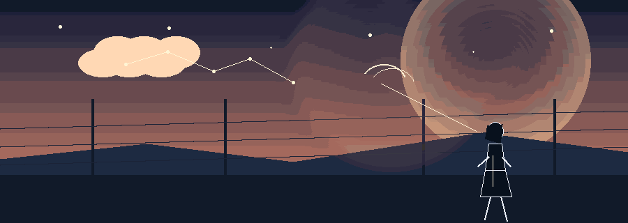

  I am a full-stack engineer building database tools, inventory workflows, high-performance dashboards, and browser utilities. My focus is simple setup, transparent data flow, and interfaces that eliminate operational friction.

---

## 🛠️ My Core Stack

  
  
  
  
  
  
    
  

---

## 🚀 Featured Work & Engineering Takeaways

Here are my most impactful and marketable open-source projects, along with the core architectural takeaways from building each:

<table>
  <tr>
    <td valign="top" width="50%">
      
      <h4><a href="https://github.com/Modracx/frontend-dev-tools">frontend-dev-tools</a></h4>
      
All-in-one suite of web development utilities for code formatting, asset conversion, schema validation, and bundle optimization.

      <ul>
        <li><strong>Tech:</strong> PHP, JavaScript, Web Tooling, Modular Architecture</li>
        <li><strong>Takeaway:</strong> Unified fragmented web utilities into a clean, zero-friction developer workbench, prioritizing client-side execution to keep workflows private and lightning-fast.</li>
      </ul>
    </td>
    <td valign="top" width="50%">
      
      <h4><a href="https://github.com/Modracx/admin-dev-tools">admin-dev-tools</a></h4>
      
Developer toolbar for Magento 2 providing instant cache flushes, index management, cron monitoring, and log streaming.

      <ul>
        <li><strong>Tech:</strong> PHP, Magento 2 Architecture, Admin Toolbar, Debugging</li>
        <li><strong>Takeaway:</strong> Eliminated the need for repetitive terminal commands during store development by hooking into native lifecycle events to provide a non-intrusive HUD with instant actions.</li>
      </ul>
    </td>
  </tr>
  <tr>
    <td valign="top" width="50%">
      
      <h4><a href="https://github.com/Modracx/Webadmin">Webadmin</a></h4>
      
Lightweight, open-source server administration panels for Apache & Nginx with plug-and-play Debian packages.

      <ul>
        <li><strong>Tech:</strong> Go, Linux System Automation, Apache/Nginx, Debian Packaging</li>
        <li><strong>Takeaway:</strong> Engineered as a compiled Go binary to replace bloated control panels, delivering instantaneous virtual host configuration and service control with near-zero memory footprint.</li>
      </ul>
    </td>
    <td valign="top" width="50%">
      
      <h4><a href="https://github.com/Modracx/endpoint-load-tester">endpoint-load-tester</a></h4>
      
Minimalist browser-based HTTP load tester, concurrency analyzer, and rate-limit probe.

      <ul>
        <li><strong>Tech:</strong> HTML5, Vanilla JavaScript, Fetch Streams, Latency Analysis</li>
        <li><strong>Takeaway:</strong> Engineered a pure browser tool with dual IPv4/IPv6 detection, real-time percentile metrics, and cURL export without requiring installation or remote proxy servers.</li>
      </ul>
    </td>
  </tr>
  <tr>
    <td valign="top" width="50%">
      
      <h4><a href="https://github.com/Modracx/Invyte">Invyte</a></h4>
      
Modern inventory management system built to operate directly over Magento store catalogs.

      <ul>
        <li><strong>Tech:</strong> PHP / Lumen, Vue.js, MySQL</li>
        <li><strong>Takeaway:</strong> Decoupled stock operations from heavy e-commerce admin panels into a micro-backend with reactive client caching, accelerating high-volume batch inventory edits.</li>
      </ul>
    </td>
    <td valign="top" width="50%">
      
      <h4><a href="https://github.com/Modracx/Orqa">Orqa</a></h4>
      
Personal finance tracking dashboard focused on visual budget transparency and friction-free logging.

      <ul>
        <li><strong>Tech:</strong> Next.js, TypeScript, Tailwind CSS</li>
        <li><strong>Takeaway:</strong> Implemented optimistic UI updates and strict TypeScript data contracts so transaction entries and metric aggregations feel instantaneous.</li>
      </ul>
    </td>
  </tr>
</table>

---

## 🎯 How I Build Software

<table>
  <tr>
    <td valign="top" width="50%">
      <strong>1. Useful First</strong> 
      I ship the first iteration around a concrete workflow bottleneck. I prioritize solving tangible user friction before abstracting for theoretical requirements.
    </td>
    <td valign="top" width="50%">
      <strong>2. Explicit Data Flow</strong> 
      I prefer straightforward, predictable data schemas and strong contracts over layers of clever indirection that make debugging painful.
    </td>
  </tr>
  <tr>
    <td valign="top" width="50%">
      <strong>3. Operational Ergonomics</strong> 
      I build dense, scan-friendly interfaces designed for real daily tasks. High information density should never sacrifice keyboard accessibility or readability.
    </td>
    <td valign="top" width="50%">
      <strong>4. Production Polish</strong> 
      I treat setup scripts, clear naming conventions, zero-state messaging, and actionable error handling as essential deliverables—not afterthoughts.
    </td>
  </tr>
</table>

---

## 📈 Activity & Community Growth

  
  
    
  
    
  

---

## 🌌 The Orbit of Two Minds

  

  <em>An original five-shot story about mapping the unknown, hearing signal through noise, and discovering that the best work is never finished.</em>

---

## 📬 Let's Connect

  
I'm always open to discussing full-stack architecture, workflow tools, and new projects.

  
  
  
  

 

